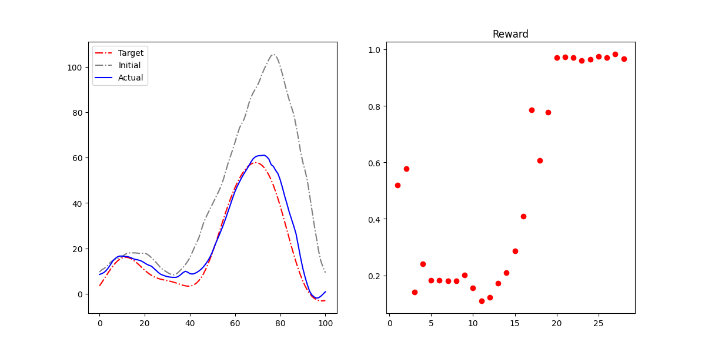

# Adaptive Prosthetic Gait Control using Reinforcement Learning

A reinforcement learning framework for adaptive control of prosthetic devices. Automatically adjusts impedance parameters for individual walking gaits using SARSA with Q-function approximation and Gaussian Mixture Models.

## Table of Contents
- [Overview](#overview)
- [Key Components](#key-components)
- [Methodology](#methodology)
- [Implementation Details](#implementation-details)

## Overview
Implements a reinforcement learning (RL) algorithm enabling prosthetic robots to adapt to individual walking patterns through:
- **SARSA** for policy evaluation
- **Quadratic basis function** for Q-function approximation
- **Gaussian Mixture Model (GMM)** as policy (generalized Actor-Critic)
- Online learning for adaptive parameter updates during walking

## Key Components
### State-Action Representation
| Component       | Description                                                                 |
|-----------------|-----------------------------------------------------------------------------|
| **State**       | Joint angle trajectory parameters extracted via ProMPs + PCA reduction |
| **Action**      | Joint torque trajectory parameters extracted via ProMPs + PCA reduction    |

## Methodology
### 1. Feature Extraction
- **ProMPs (Probabilistic Movement Primitives)** extract features from biomechanical curves
- Dimensionality reduction via PCA
- *Implementation:* [`promps.py`](scripts/promps.py)

### 2. Simulation Environment
- Neural network-based simulator trained on biomechanical data
- Input: Joint torques (`action`), Output: Joint angles (`state`)
- *Implementation:* [`env.py`](scripts/env.py), [`env_model.py`](scripts/env_model.py)

### 3. Learning Algorithm
| Component               | Description                                                                 |
|-------------------------|-----------------------------------------------------------------------------|
| **SARSA + Q-Approximation** | Policy evaluation with quadratic basis functions *Implementation:* [`SarsaGMM.py`](scripts/SarsaGMM.py) |
| **GMM Policy Update**   | Weighted EM algorithm for policy improvement *Implementation:* [`WeightedGMM.py`](scripts/WeightedGMM.py) |

### 4. Dimensionality Reduction
- PCA for compact state-action representation
- *Implementation:* [`utils.py`](scripts/utils.py)

## Implementation Details
- Implement [`main.py`](scripts/main.py) to run the whole learning frame, result is as follows:

